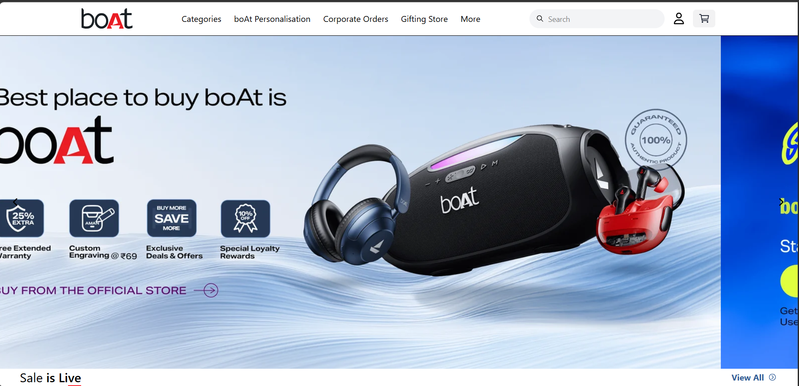
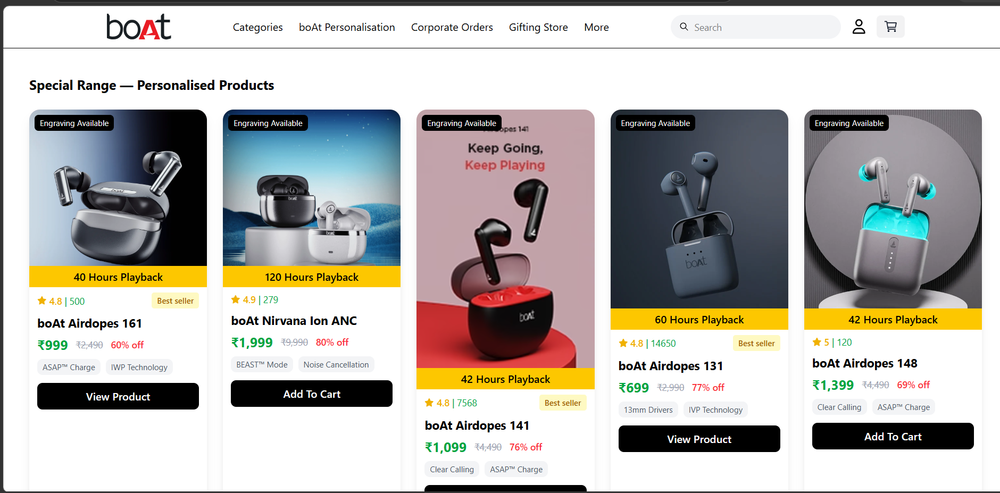
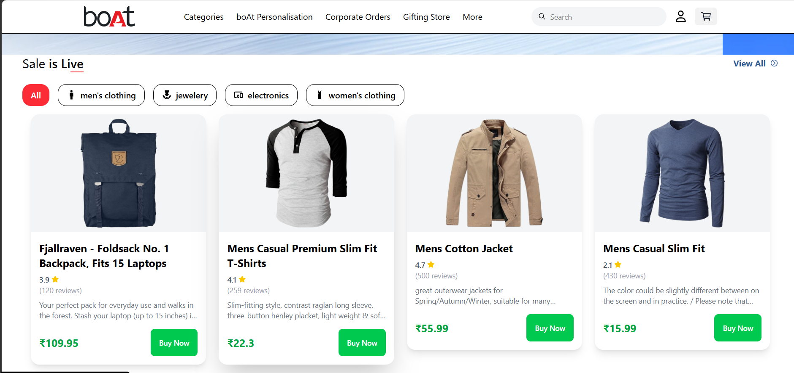
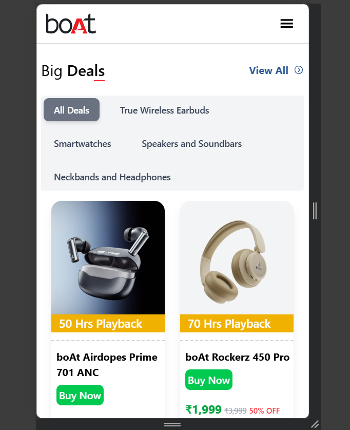

# Boat Life

A polished, responsive frontend clone of the boAt storefront, built with React and powered by real-time product data from the [FakeStore REST API](https://fakestoreapi.com/).

<p align="center">
  
</p>

## Overview

Boat Life recreates the core shopping experience of the boAt storefront with a modern, mobile-friendly UI, dynamic product catalog rendering, and interactive cart functionality. The app focuses on clean visual design, smooth filtering, and a realistic e-commerce browsing flow.

## Highlights

- Real-time product catalog from the FakeStore API
- Category-based product filtering
- Shopping cart with interactive quantity updates
- Fully responsive layout for desktop, tablet, and mobile
- Clean React component structure for maintainability
- Lightweight, client-side rendering experience

## Tech Stack

- React
- JavaScript / JSX
- CSS Modules / Custom Styling
- FakeStore REST API

## Screenshots

<p align="center">
  
</p>

<p align="center">
  
</p>

<p align="center">
  
</p>

## Getting Started

### Prerequisites

- Node.js (v18+ recommended)
- npm or yarn

### Installation

1. Clone the repository
   ```bash
   git clone https://github.com/your-username/boat-life.git
   cd boat-life
   ```

2. Install dependencies
   ```bash
   npm install
   ```

3. Start the app
   ```bash
   npm start
   ```

4. Open the app in your browser at:
   ```bash
   http://localhost:3000
   ```

## Project Structure

```bash
src/
├── components/
├── pages/
├── data/
├── styles/
├── App.jsx
├── main.jsx
└── index.css
```

## Notes

This project is a frontend clone designed for learning and demonstration purposes, with product data sourced dynamically from the FakeStore API. It captures the essential boAt storefront experience while keeping the implementation clean and scalable.

## License

This project is for educational and portfolio use.
